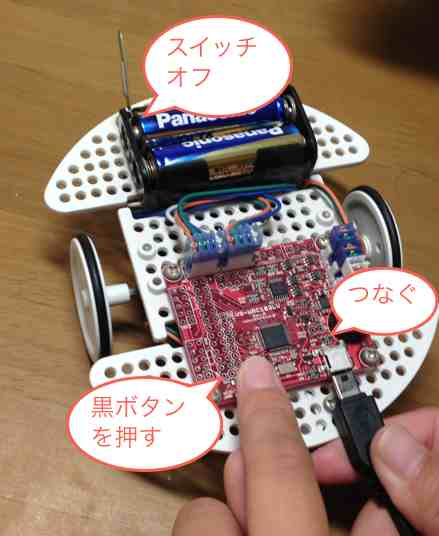
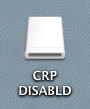

## バイナリをロボカーに焼く

ビルドがエラーなく終了すると、
バイナリが `workspace/プロジェクト名/Debug/プロジェクト名.bin` に出来上がっている。

### hkimura Mac で焼く場合

1. バイナリ転送する。
1. 教卓に並ぶ。
1. ロボカーのスイッチをオフにし、黒スイッチを押したまま、
USB ケーブルをつなぐ。ケーブルの裏表に注意。<br>

1. 接続を確認したら、次のコマンド、
````sh
$ ./burn 40.bin
````
をターミナルから入力。40.bin はアップロードの際にメモしたファイル名。

success が表示されたら、ケーブルを外し、
安全な場所でロボットのスイッチをon。
ロボカーはみんなのプログラムに沿って動き出す。

### 自分 Mac、Windows で焼く場合

1. ロボカーのつなぎ方は上といっしょ。
2. ロボカーは CRP DISABLD の名前で USB メモリとしてマウントされる。
下図は MacOSX のものだが、Windows でもほぼ同じ。
ただし、マウントするまで 30 秒弱かかる。<br>
    
3. CRP DISABLD 中のファイル firmware.bin を削除する。
4. `workspace/プロジェクト名/Debug/プロジェクト名.bin` を CRP DISABLD 中にコピー。
5. コピーが完了したら、USB メモリを安全な方法で外す。
6. ロボカーのスイッチをオン。


[back](../index.html)
----
Last update: <script>document.write(document.lastModified);</script>
