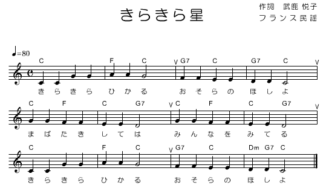

## キラキラ星の演奏

いきなり、ロボカーのプログラミングに挑戦。みんなが子供の頃に歌った「キラキラ星」をプログラムします。プログラムの詳しい内容は来週以降。今日は、

* プログラムの書き方
* コンパイルの仕方
* 転送の仕方
* ロボカーへの焼き付け方

を覚えること。

### プロジェクト開始
robocar.zip をインポート、プロジェクトの名前を kirakira に変更（しているはず）。

### main.c を編集

src/main.c に４行追加する(この書き方に慣れること)。

````c
#include "LPC13xx.h"
#include "gpio.h"
#include "vs-wrc103.h"
#include "ixbus.h"

int main(void)
{
  const unsigned short MainCycle = 60;
  Init(MainCycle);

  BuzzerSet(120, 100); // ピッチ 120、ボリュームは 100 だ。
  BuzzerStart();       // ブザー鳴れ。
  Wait(3000);          // 3秒待つ。
  BuzzerStop();        // 鳴りやめ。

  return 0;
}
````

### ビルド

ビルド（コンパイル）はトンカチボタン 。
赤ペケ出たら、よーく上と比べる。

### バイナリ転送

1. [http://robocar-2014.melt.kyutech.ac.jp](http://robocar-2014.melt.kyutech.ac.jp)
の左上、バイナリ転送をクリック、

2. choose File でコンパイルしたバイナリ Debug/kirakira.bin を選んで送信ボタン、

ブラウザ上に "〜〜〜 としてアップロードしました" と出るので、それをメモし、
ロボカーを教卓付近に連行する。

### 焼き付け

[別ページ](/burn/) に書きました。

みんなのグループのロボカーは声をあげたかな？

###　ロボカーと音の関係

|音程|ド|レ|ミ|ファ|ソ|ラ|シ|ド|
|:--:|:-:|:-:|:-:|:-:|:-:|:-:|:-:|:-:|
|pitch|179 |160 |142 |134 |120 |107 |95 | 90|

### TRY

* 三三七拍子、行ってみよう。
* ベートーベン「運命」はソソソミー、ファファファレーだ。
* キラキラ星に挑戦しよう。



[back](../index.html)
____
Last update: <script>document.write(document.lastModified);</script>

