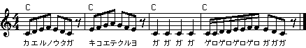

### Making of Kirakira

先週の授業では、

* グループを結成した。
* キラキラ星を演奏するプログラムを作った。
* プロジェクトのインポート、編集、ビルド、バイナリ転送、ロボカーの焼き付けを覚えた。
* ロボカーが理解する関数(BuzzerSet(), BuzzerStart(),...)を使えば楽勝だった。
* (マイカーとマイPCがあればもっと楽と理解した。)

____
### プログラムを改良する

みんなの作ったプログラムはだいたいこんな感じ。

    int main(void)
    {
      const unsigned short MainCycle = 60;
      Init(MainCycle);

      BuzzerSet(179, 100);
      BuzzerStart();
      Wait(400);
      BuzzerStop();
      Wait(100);
      ...
      ...
    }

もっと詳しくは [main.c](main.html)
____

### どこを改良するか？

「動けばいい」はダメ。
もうちょっと課題が難しくなるとすぐに動かなくなる。

* プログラムは一発では完成しない。
* main関数を短く、わかりやすく。
* コピペをなるべく使わない。その理由は?
    * 授業中に言います。
    * 授業中に考えよう。
    * 友人の意見は?

まず、関数を利用して、BuzzerSet()...Wait(3000); までのブロックをまとめよう。
<!--
たとえばこんなのどうですか？ =>
[main2.c](main2.html)
-->
____

### まだ改良する

* だいぶ見やすくなったが関数DO( ) や SO( )のボディはほとんど同じ。
* プログラムに変更が必要になったら、関数の数だけ変更する箇所がある。
* 変更箇所がたくさんあると変更のときに間違う危険が増える。

共通する部分をさらに別の関数にまとめよう。

<!--
[main3.c](main3.html)
-->
____

### さらに改良

キラキラ星の場合、一つ一つの音符のボリューム、音長さ、休み時間は同じ。

同じ長さは別のところにプログラムしておくと、
後で変更したくなっても、変更の箇所がプログラム中に散らばらず、作業が楽になる。

<!--
[main4.c](main4.html) を見よ。
-->

(しかし、音符の長さはふつう異なる。
このページの改良は別の楽曲のプログラムの場合は改悪になることがある。)

----

### 完成と思ったところでさらに

関数 DO( ), RE( ), MI( ) はグッドアイデアであったが、さらにアイデアをしぼる。

楽曲を配列で表現しよう。DO, RE, MI を音のピッチを表す定数に変更する。
配列の最後に、「配列はここで終わり」を示すマークをつけておく。
ロボカーはそのマークを読んだら演奏を終了する。

* こうすることのメリットはなにか?

メリットを考えられない受講生はくだらん。
授業中のスクリーンに映るプログラムをひたすらコピーするだけではプログラミング力は着かない。

コピーで済まそうと考える学生は積極的に落とす方針です。

<!--
[main5.c](main5.html)
-->

----

### もっとプログラム

キラキラ星以外の楽曲も鳴らしたいぞ。

カエルの歌だ。しかし、カエルの歌にはキラキラ星には出てこなかった休止府もある。

なので、プログラムを変更。楽曲の終わりの他に、休止符を理解するように改良する。

<!--
[main6.c](main6.html)
-->

----

### 趣味で

[main7.c](main7.html) の変更は軽微です。

関数 kirakira() と関数 kaeru() の中で、ともに for ループを呼んでいるのが
見苦しいと思われたので、それを関数 music() に変更。

----

### 短い音符も

カエルの歌には休止符の他、短い音符も出てきます。短い音符をどうプログラムするか、
方法はいろいろある。
ここでは DURATION と PAUSE の長さを変えることにする。

この方法はベストではない。逆に、悪い方から数えて何番目、くらい。
受講生は別の方法でトライすること。

* どんな方法があるか?
* 考えついた方法をプログラムに表現してみよ。その努力がみんなを大人に、日本を幸せにする。

<!--
[main8.c](main8.html)
-->

