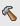

## ビルド
授業では主に `project/src/main.c` にプログラムを書く。

正しくコーディングできたら作成したソースコードをバイナリにコンパイルする。

LPCXpresso でのコンパイル(ビルド)は  をクリックする。

ビルドがエラーなく終了すると、ロボカーに焼き付けるバイナリが

````
project/Debug/project.bin
````

に出来上がる。

### エラーの際は

プログラムに間違い（エラー）を入り込ませてしまうのはきわめてふつう。
しかし、エラーがあるとプログラムはビルドできず、ロボカーに焼けない。


「ビルドに失敗しました」の表示に気づかずビルドできたと思い込み、
過去のバイナリを繰り返しロボカーに繰り返し焼き付け、
泥沼にはまったチームが過去にはあった。
なんど焼いてもロボカーの動きは変化なし...


####  について

LPCXpresso はエラーが見つかった行の左に
<span class='warn'>赤丸</span>にペケの

マークを表示する。


ウィンドウの右の方に見える
<span style="border:1pt solid red;">&nbsp;&nbsp;</span>
はそのエラーがプログラム全体のどのあたりにあるかを示している。
（スクリーンショットは黄色っぽいが本来は赤です）。


にカーソルをあわせるとエラーの内容を教えてくれる。
ひどい日本語の時もあるが、そのひどい日本語はどんな意味か、
メモをとって覚えよう。


上の例ではとじ括弧が余計。それを削除し、ビルドすると
、
<span style="border:1pt solid red;">&nbsp;&nbsp;</span>
は消える。

プログラムのどこかに一カ所でも

があるときはビルドは失敗する。

の原因を LPCXpresso の助けを得、あるいは自力で解決しなければ、
ビルドできない。ここが勉強のしどころだ。</p>

####  について

時には 
が表示されることがある。


は警告（warning）といい、ビルドは失敗しないものの、
エラーにつながる箇所であることを示すものだ。たとえば下の例では
関数 run() の戻り値は int と宣言しているのに、戻り値を return していない。


ビルドには成功しても、run() を呼び出す関数（ここでは main())
でその戻り値を利用したりすると、戻り値がないんだから確実にエラーとなる。

どれが軽微なミスで、
どれが重大なエラーにつながるかは場数を踏まなければわからないかも。</p>

プログラムに表示された
警告マーク
の意味がわからなかったらとりあえず
hkimura や TA に質問してみよう。</p>


今期の授業が終わる頃には警告の意味を理解し、修正できるようになる。

[
[up](../index.html)
|
[立ち上げ](start.html)
|
[プロジェクト開始](projects.html)
|
[ビルド](build.html)
|
[転送](transfer.html)
|
[焼付](burn.html)
]


----
Last update: <script>document.write(document.lastModified);</script>
