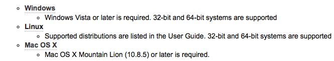

## LPCXpresso:download

授業で使うのと同じバージョンの LPCXpresso のWindows/Linux/MacOSX 版は
[http://www.lpcware.com](http://www.lpcware.com/lpcxpresso/download)
から無料でダウンロードできる。

ダウンロードしたファイルをダブルクリックでインストーラーが立ち上がります。

Windows版で、ロボカー用ではない、Windows で走る C のプログラムを開発するには、
もうちょっと作業が必要になります（だれか書いて）。

----
Last update: 
