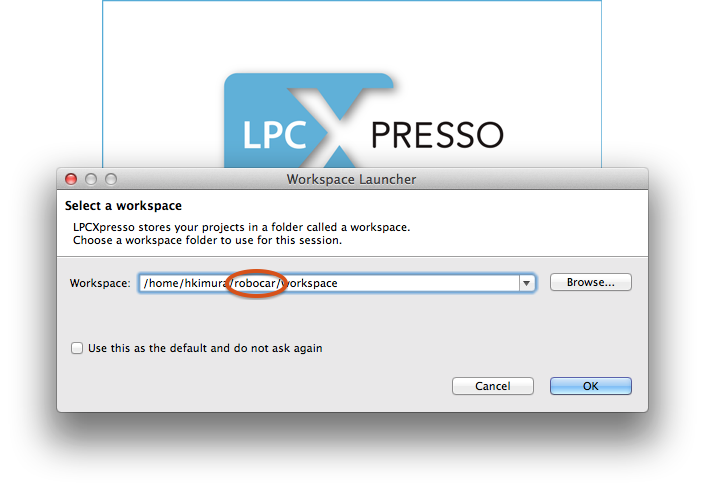
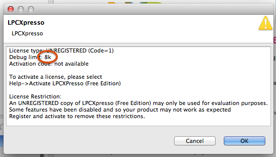

## LPCXpresso


eclipse のプラグイン。情報センターのＰＣには version 4 と vesion 7 をインストール。
通常の C プログラムの開発と、ロボカーを動かすプログラムの開発の両方で利用する。

### 最新版は version 7.3.0
2014から。立ち上げは、

````sh
$ lpcxpresso &
````

ネットから Windows/OSX/Linux 版が無料でダウンロードできる。
ダウンロード・インストールの方法は
[ここ](to_my_pc.html)
。


### version4
2013まで使用した実績あり。
古いため、ネットに同じバージョンのものは見つからない。
version7 がダメなときはこっちを使おう。立ち上げは、

````sh
$ lpcxpresso4 &
````

###ワークスペース

ワークスペースは作成したプログラムのセーブ場所と思って80%大丈夫。



ログインアカウントとworkspaceの間に robocar を入れて OK ボタンを押す。

<span class='warn'>まちがうと成績評価されない</span>。正確に。</li>

### 評価版で OK



レジストレーションしていない LPCXpresso は 8k 以上のプログラムは作れない。
大丈夫。受講生が毎年作るロボカープログラムの平均的なサイズは 3k ぐらい。

OKボタンを押して進む。

<!--
[戻る]("../")
-->