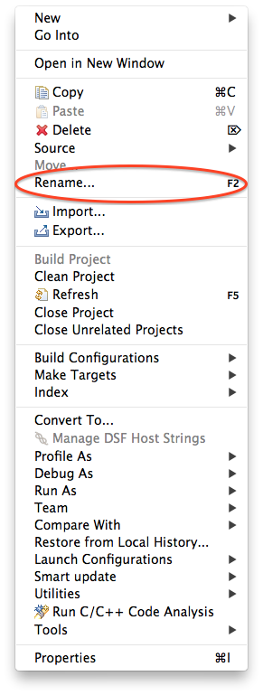
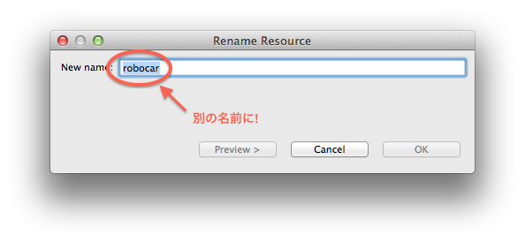

## プロジェクト開始

### 準備の準備

[授業資料](/)
の左上メニューから robocar.zip をダウンロードしておく。
情報センターPCではダウンロードフォルダにセーブされるはず。

このrobocar.zip は新しいプロジェクトをスタートするたびに使います。

### プロジェクト開始

ロボカーの開発に必要なプロジェクトをインポートします。

1. LPCXpresso を立ち上げ、
2. ウィンドウの左中央あたり、import project(s)ボタンを押す。 
  
3. Archiveの右、Browse...ボタンを押し、先ほどダウンロードした robocar.zip を選ぶ。 
  
4. Next ボタンでページが切り替わり、Finish ボタンでインポート完了。ウィンドウ左上はこんな感じ、 
  
5. もうひとふんばり。後日、別のプロジェクトを開始するときのため、
  インポートしたばかりの robocar プロジェクトの名前を変えておく。
  robocar の上を右クリック。
  現れるメニューの Rename を選択。 
  
6. 別の名前に換えておく。 
  

以上で準備完了。先ほど選んだ別のプロジェクト名（この例では music としました）を選んで、開発スタート。

[
[up](../index.html)|
[立ち上げ](start.html)|
[プロジェクト開始](projects.html)|
[ビルド](build.html)|
[転送](transfer.html)|
[焼付](burn.html)
]
----
Last update: 

