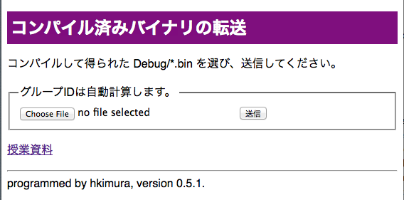
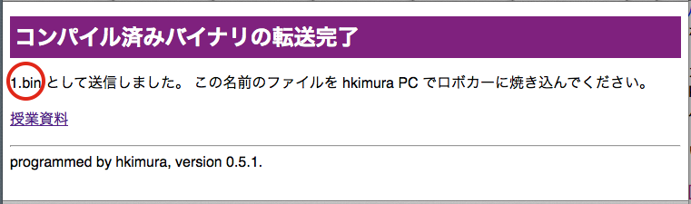

## バイナリ転送
残念ながら、情報処理センターのPCはバイナリをロボカーに焼けない。

ロボカーは PC には USB スティックに見えるので、
自分PC(Windows あるいは Mac)にバイナリを転送し、
そのバイナリを USB スティックにコピーするとロボカーは動き出す。

あるいは、授業中であれば、hkimura の Mac にバイナリを転送し、ロボカーに焼き付ける。

1. [http://robocar-2014.melt.kyutech.ac.jp](http://robocar-2014.melt.kyutech.ac.jp)
を開き、左上の方に見つかるバイナリ転送をクリック、
1. ログインが必要ならログインし、(アカウントを持たない学生はバイナリ転送できません)
1. バイナリの位置を正確に入力、
1. 送信ボタンを押す。

の表示が出る。`1.bin`のところを覚えて、ロボカー持って教卓に直行する。

----

