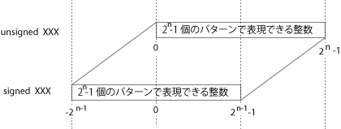

## 前進 1cm!

今日のプロジェクトは motor。import project, rename project の例の手順で準備せよ。

テーマは char, int, short, unsigned, signed の意味を知る、だ。準備はいいか?

### Mtr_Run_lv()

motor プロジェクトの main.c を書き換える。

* 関数 Mtr_Run_lv() はロボカーのモーターを制御する。
* ロボカーには最大６個のモータを乗せることが可能であるため、
関数 Mtr_Run_lv() も６つのモーターを制御できるようなプログラムになっている。
* しかし、授業で使うロボカーに搭載のモーターは二つ。
* 関数 Mtr_Run_lv()は６つの引数を取り、それぞれ第一のモーター、第二のモーター、
... 第６のモータの出力を命令する。授業のロボカーで有効なのは最初の二つだけ。
あとの４つは単に無視される。

````c
// ロボカーを 5 秒前進させる。
// プログラム的にはあまり良くない。
// 先週の授業を思い出して改良せよ。
#include "LPC13xx.h"
#include "gpio.h"
#include "vs-wrc103.h"
#include "ixbus.h"

int main(void)
{
  const unsigned short MainCycle = 60;
  Init(MainCycle);

  Mtr_Run_lv(10000, -10000, 0, 0, 0, 0);
  Wait(5000);
  Mtr_Run_lv(0, 0, 0, 0, 0);

  return 0;
}
````

### 演習１
1. Wait(5000)でロボカーが何cm進んだか、測定せよ。
1. ロボカーを 1cm 前進、静止させよ。
1. ロボカーを 10cm 前進、静止させよ。
1. ロボカーを 5cm 後退させよ。
1. スイッチ入れて２秒後にロボカーをスタートさせよ。

### 演習２
1. ロボカーを 90 度、右回転させよ。
1. ロボカーを 360 度、左回転させよ。

### 演習３
1. ロボカーを2倍の速度で10cm 前進、静止させよ。
1. ロボカーを1/2の速度で10cm 前進、静止させよ。

## Mtr_Run_lv() を調べる

関数 Mtr_Run_lv() はファイル vs-wrc103.c の 195 行目に定義されている。
その最初の行（シグナチャという）に注目。

````c
void Mtr_Run_lv(short m1, short m2, short m3, short m4, short m5, short m6)
````

このシグナチャは、

* 関数の戻り値は void
* 関数の名前は Mtr_Run_lv
* 関数の引き数は short 型の m1, m2, ... , m6 の６つ

であることを示す。

授業ではシグナチャ以外、関数 Mtr_Run_lv()のボディは深入りしない。
授業のレベルを超えて勉強したい学生はどんどん行け。
「short 型の m1」って意味がわかるか？が授業で求めるレベルだ。

### ビットを理解する

ビット(bit)は 0 か 1 か必ずどちらかの状態を取る。

### char, short, int, long

CPU によって違うが、ロボカーに搭載されている CPU(ARM) の場合、

| 型|ビット長|表現できるデータの種類|unsigned|signed|
|:-:|:------:|:---------------:|:----:|:----:|
|char  |8bit |2<sup>8</sup>通り|0 ~ 2<sup>8</sup>-1| -2<sup>7</sup> ~ 2<sup>7</sup>-1|
|short |16bit|2<sup>16</sup>通り|||
|int   |32bit|2<sup>32</sup>通り|||
|long  |64bit|2<sup>64</sup>通り|||

#### 演習4 (中学生か小学生レベル)
* 2<sup>8</sup> はいくらか？ 2<sup>16</sup>, 2<sup>32</sup>, 2<sup>64</sup> は？
上の表の空欄を埋めよ。

### (double, float)

小数点付きの数を保持するときに使う。
ロボカー授業では使わない。
float は他の場所でも現在はほとんど使われない。

### unsigned, signed

bit パターンの解釈の方法。

* unsigned (符号なし)は 0 をいちばん小さい数と考える。
すべてのビットが 1 のパターンを最大の整数とする。

* signed (符号あり)は 0 を中央のデータとする。
すべてのビットが 1 のパターンは 1 足すと 0 になるという性質から -1 と考える。

signed/unsigned が省略された場合は signed が指定されたと考える。

<p></p>

### short m1

Mtr_Run_lv()の引き数 "short m1" は、書き方を省略しないとすれば "signed short m1"。
つまり、"符号付き 16 ビットの整数 m1"。その意味を理解できないとダメ。

short m1 と宣言された変数 m1 が取りうる値の最小値、最大値はいくらか？

### 演習5
* Mtr_Run_lv(10000,-10000,0,0,0,0)　に比較し、
Mtr_Run_lv(40000,-40000,0,0,0,0)が
４倍速にならない理由を述べよ。

## 本日のグループ課題

一辺が 30cm の正方形の辺に沿ってロボカーを走らせろ。一周したら静止。
完成したらロボカーの演技を hkimura に見せ、そのプログラム main.c を送信する。

[戻る](/)

----
written by hkimura.
