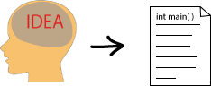

## プグラミングとは



モコモコしてつかもどころのないアイデアを紛れのないテキストとして書き下すこと。

### C「言語」

コンピュータが意味を正確に把握できるよう、まぎれがないよう、設計された人工言語。

これに対して、われわれの日本語や英語は自然言語と呼ばれる。

* わたしはまちがすき。
* 大江山　いく野の道の　遠ければ　まだふみもみず　天の橋立
* わたしの言っていることは嘘です。

### C 言語の「文法」

* プログラムは英数字で記述する。
* 単語はスペース文字で区切られる。
* 連続するスペース、タブ、改行文字はただ一つのスペース文字として扱う。
* 文はセミコロン(;)で区切られる。
* 複数の文は波かっこ { } でまとめられる。とりあえずブロックと呼んでおこう。
* ファイル中に複数の関数を定義できる。
* 関数の内部には関数を定義できない。
* 好きなだけ関数を定義してよい。
* 必要であれば変数を使ってよい。
* 関数や変数は使う前に定義されるべし。
* scanf/printf は特別な関数でめんどくさい。ごめんなさい。
* main は特別な関数で、プログラムの開始場所となる。
* main のブロックが終了するか、main の途中で　return あるいは exit が呼ばれるとプログラムは終了する。
* ...

こういうのは使いながら覚えたほうがいい。

### 10 個の正整数の和を求める

今日のプロジェクトは sum だが、あけ方はいつもと違う。授業をよく聞くように。

src/sum.c を書き換える。

````c
#include <stdio.h>
#include <stdlib.h>

int main(void) {
  int x0;
  int x1;
  int x2;
  int x3;
  int x4;
  int x5;
  int x6;
  int x7;
  int x8;
  int x9;

  x0=5;
  x1=1;
  x2=4;
  x3=34;
  x4=98;
  x5=334;
  x6=668;
  x7=889;
  x8=9;
  x9=5963;

  int sum;
  sum = x0 + x1 + x2 + x3 + x4 + x5 + x6 + x7 + x8 + x9;
  printf("sum=%d\n",sum);
  return 0;
}
````
つらすぎる。それでも、すべての文がセミコロンで終わっていることは注目しておけ。

配列覚えろ。

````c
#include <stdio.h>
#include <stdlib.h>

int main(void) {
  int x[10]; // 名前は x で添え字は 0 から始まる。配列の最後は x[9]。

  x[0]=5;
  x[1]=1;
  x[2]=4;
  x[3]=34;
  x[4]=98;
  x[5]=334;
  x[6]=668;
  x[7]=889;
  x[8]=9;
  x[9]=5963;

  int sum;
  sum = x[0] + x[1] + x[2] + x[3] + x[4] + x[5] + x[6] + x[7] + x[8] + x[9];
  printf("sum=%d\n",sum);
  return 0;
}
````

まだかなしい。
配列の初期化を覚えろ。
````c
#include <stdio.h>
#include <stdlib.h>

int main(void) {
  int x[]={5,1,4,34,98,334,668,889,9,5963};

  int sum;
  sum = x[0] + x[1] + x[2] + x[3] + x[4] + x[5] + x[6] + x[7] + x[8] + x[9];
  printf("sum=%d\n",sum);
  return 0;
}
````

もう一踏ん張り。足し算を for ループでプログラムしよう。

````c
#include <stdio.h>
#include <stdlib.h>

int main(void) {
  int x[]={5,1,4,34,98,334,668,889,9,5963};

  int sum;
  sum = 0;
  int i;
  for (i=0; i<10; i++) {
    sum += x[i];
  }
  printf("sum=%d\n",sum);
  return 0;
}
````

だいぶいいんじゃね？

### 改良その１

10個と決まってないとき。最初に個数を入力させ、その分、キーボードから読み込む。

````c
#include <stdio.h>
#include <stdlib.h>

int main(void) {
  int n;
  printf("n?");
  scanf("%d",&n);

  int x[n];
  int i;
  for (i=0; i<n; i++) {
    printf("?");
    scanf("%d",&x[i]);
  }

  int sum;
  sum=0;
  for (i=0; i<n; i++) {
    sum+=x[i];
  }

  printf("sum=%d\n",sum);
  return 0;
}
````

<span style='color:red;'>注意</span>
このプログラムの書き方はつい最近、できるようになった。
昔の C しか知らない先生が見たらぶったまげる。そんなときは「先生、遅れてますよ」と言ってあげよう。
研究室のコンピュータがこのプログラム書けなかったら「バージョンアップしましょう」と言え。

### 配列使わんでもできねーか？

長くなったんで[次のページ](second.html)へ。

---
written by hkimura, 2014-10-29.


